<a id="top"></a>

<div style="text-align: center;">
    
</div>

# **QuESt Planning**: A Long-term Power System Expansion Planning Tool Focused on Energy Storage Systems

Current release version: 1.0.0

## Table of Contents
- [Introduction](#intro)
- [Key Features of QuESt Planning](#key-features)
- [Getting Started](#getting-started)
- [Workflow of QuESt Planning Tool](#workflow)
    - [Data Preparation](#data_prep)
    - [Graphical User Interface](#gui_workflow)
    - [Advanced Simulations](#advanced)
- [Examples](#examples)
- [Tips for Running the QuESt Planning Tool](#tips)
- [Feedback](#feedback)
- [Development Status](#development-status)
- [Acknowledgements](#acknowledgement)

## Introduction 
<a id="intro"></a>

QuESt Planning is a capacity expansion planning model that identifies cost-optimal energy storage, resource, and transmission investments to meet grid decarbonization targets. This tool is part of [QuESt 2.0](https://github.com/sandialabs/snl-quest): Open-source Platform for Energy Storage Analytics. Below is a high-level overview of the inputs and outputs of the QuESt Planning tool.
<div style="text-align: center;">

</div>
Long-term capacity expansion planning models are complex optimization models that require careful consideration of modeling assumptions and input data. Model build and solve times can vary significantly, from minutes to days, based on assumptions made while configuring the model inputs and the selection of solver. For more guidance, please refer to the Tips section.

<!--QuESt Planning documentation is under development and will be available [here](https://github.com/sandialabs/snl-quest).-->

[Back to Top](#top)
## Key Features of QuESt Planning
<a id="Key-features"></a>
Key features of the QuESt Planning tool include:

- **Optimization for Grid Decarbonization:** Leverages a Pyomo-based optimization model to find the optimal mix of generation, transmission, and storage to meet long-term grid decarbonization goals or similar policies.

- **Energy Storage System Evaluation:** Designed to evaluate a broad range of energy storage technologies and their role in the optimal mix of generation required to meet the decarbonization goals. Users are able to define energy storage technologies based on power and energy capacity cost, asset lifetime, round-trip efficiency, and other operational characteristics. 

- **Model Flexibility:** Supports various scenarios and sensitivity analyses to explore different investment portfolios and pathways.

- **Scenario-based Planning:** Allows users to develop multiple scenarios to evaluate planning sensitivities and scenarios.

- **User-Friendly Interface:** Simplifies the process of input data upload, planning model setup, scenario construction, model execution, and results interpretation.

- **Enhanced Visualizations:** The QuESt Planning tool provides several visualizations of the optimization model results, including optimal resource expansion plots, costs breakdowns, and interactive maps. 

[Back to Top](#top)
## Getting started
<a id="getting-started"></a>

### Prerequisites
- Python 3.11

### Solver Installation

Ensure an optimization solver is installed on your machine. For best performance, use a commercial solver such as Gurobi and Cplex. Solvers to consider include:

**Commercial Solvers**
- [Gurobi](<https://www.gurobi.com/>)
- [Cplex](<https://www.ibm.com/products/ilog-cplex-optimization-studio>)

**Open-source Solvers**
- [GLPK](<https://www.gnu.org/software/glpk/>)
- [Clp](<https://github.com/coin-or/Clp>)
- [HiGHs](<https://highs.dev/#top>)

### Setting Up a Virtual Environment
1. Install `virtualenv` (if not already installed):
    ```bash
    python -m pip install virtualenv
    ```

2. Create a virtual environment (named `venv`):
    ```bash
    python -m virtualenv venv
    ```

3. Activate the virtual environment:
   - On Windows:
     ```bash
     .\venv\Scripts\activate
     ```

### Cloning the Repository and Installing Dependencies
1. Clone the repository:
    ```bash
    git clone <repository_url>
    ```
   Replace `<repository_url>` with the URL of the QuESt Planning repository.

2. Navigate to the QuESt Planning Directory:
    ```bash
    cd path/to/quest_planning
    ```
   Replace `path/to/quest_planning` with the name of the directory where QuESt Planning was cloned.

3. Install Dependencies:
    ```bash
    python -m pip install -r requirements.txt
    ```
### Run the QuESt Planning Tool
1. Once the dependencies are installed, ensure you have navigated to the **parent** directory where QuESt Planning is installed and the virtual environment is activated. You can run tool using the following command:

    ```bash
    python -m quest_planning
    ```

[Back to Top](#top)
## Workflow of QuESt Planning Tool<a id="workflow"></a>


The figure below provides the basic structure of the QuESt Planning tool. The input data are in the form of CSV files and more information can be found in the [Data Preparation](#data_prep) Section. There are two options for running the QuESt Planning tool: 

- Option A: [Graphical User Interface](#gui_workflow): This application is designed for smaller problems and allows for enhanced visualizations.

- Option B: [Advanced Simulations](#advanced): This command-line script is designed for larger problems and enables the use of remote computing for advanced simulations.

<div style="text-align: center;">
   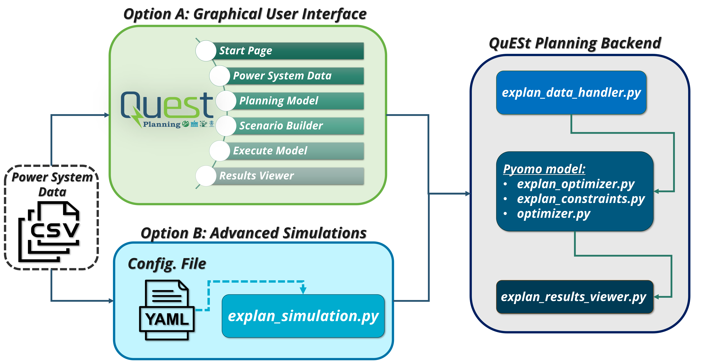
</div>


### Data Preparation<a id="data_prep"></a>
The input data is constructed via several CSV files. The QuESt Planning tool require the following CSV files with correct format in the `data_explan` folder within the `quest_planning` directory:

#### Power System Data

- [**bus.csv**](#bus)
- [**branch.csv**](#branch)
- [**gen.csv**](#gen)
- [**gen_viz.csv**](#gen_viz)
- [**tech.csv**](#tech)
- [**storage.csv**](#storage)
- [**load.csv**](#load)

#### Economic Data
- [**capex_tech.csv**](#capex)
- [**capex_es.csv**](#capex_es)
- [**fuel.csv**](#fuel)

#### Renewable Profile Data
- [**solar.csv**](#solar)
- [**solar_cand.csv**](#solar_cand)
- [**wind.csv**](#wind)
- [**wind_cand.csv**](#wind_cand)

#### Other Files
- [**policy,csv**](#policy)
- [**scalars.csv**](#scalars)


The CSV files and the associated data are structured as follows:

<a id="bus"></a>
### `bus.csv`

| Column       | Description                           |
|--------------|---------------------------------------|
| Number       | Bus number                     |
| Bus_name    | Bus name                         |
| Bus_number       | Bus number                            |
| Load_share   | Share of system peak load (%)               |
| LAT           | Latitude                |
| LON            | Longitude |

<a id="branch"></a>
### `branch.csv`

| Column       | Description                           |
|--------------|---------------------------------------|
| Line_Number    | Unique branch ID                      |
| From_Bus     | From Bus Number                           |
| From_Bus_Name    | From Bus Name                          |
| To_Bus       | To Bus Number                           |
| To_Bus_Name  | To Bus Name                             |
| Rating_F       | Forward Rating (MW)                            |
| Rating_B      | Backward Rating (MW)                             |
| R            | Branch resistance p.u.                |
| X            | Branch reactance p.u.                 |
| B            | Branch charging susceptance p.u. |
| Length       | Line length (miles)                             |
| Tx_Cost       | Transmission Cost                            |
| Tx_limit       | Transmission investment limit (MW)    |
| Lead_Time       | Transmission investment lead time (years)       |

<a id="gen"></a>
### `gen.csv`

| Column       | Description                           |
|--------------|---------------------------------------|
| Gen_num | Generator number                 |
| Gen_name      | Generator name |
| Bus_num       | Bus number where generator is located     |
| Bus       | Bus name where generator is located     |
| Tech            | Generator technology name          |
| Tech_Num            | Generator technology number           |
| Cap            | Generator installed capacity (MW) |
| MinCap            | Generator minimum stable level (MW) |
| CandCap           | Generator maximum annual investible capacity (MW) |
| SystCap           | Generator maximum total investible capacity (MW) |
| PlannedYr     | Planned year for operation |
| RetCap     | Generator planned retirement capacity (MW) |
| RetYr    | Generator planned retirement year |
| CapCred    | Capacity credit (%) |
| LeadTime    | Lead time required from investment to operation (not used) |
| YearAvail    | Eligible year for investment |
| HR    | Generator heat rate at maximum output (MMBTU/MWhr) |
| FOM    | Fixed Operating & Maintenance Cost (\$/MW) |
| VOM    | Variable Operating & Maintenance Cost (\$/MWh) |
| PTC    | Production tax credit (\$/MWh) |
| ITC    | Investment tax credit (\$/MW) |
| Lifetime    | Generator lifetime (years) |
| Ramp    | Generator ramp rate (%) |
| FOR    | Forced Outage Rate (%) |
| CO2    | CO2 emission rate (MMTons/MWhr)) |
| SO2    | SO2 emission rate (MMTons/MWhr)) |
| NO2    | NCO2 emission rate (MMTons/MWhr)) |
| TransAdder    | Transmission cost adder(\$/MW)) |


<a id="gen_viz"></a>
### `gen_viz.csv`

| Column       | Description                           |
|--------------|---------------------------------------|
| Gen_num | Generator number                 |
| Gen_name      | Generator name |
| Bus_num       | Bus number where generator is located     |
| Bus       | Bus name where generator is located     |
| Tech            | Generator technology name          |
| Tech_Num            | Generator technology number           |
| LAT           | Latitude                |
| LON            | Longitude |

<a id="tech"></a>
### `tech.csv`

| Column       | Description                           |
|--------------|---------------------------------------|
| Num | Technology number                  |
| Tech         | Name of the technology (e.g., solar, wind) |
| Tech_Name | Technology name                  |
| Tech ID   | Unique technology ID                     |
| Tech_Num | Technology number                  |
| LeadTime    | Lead time required from investment to operation (not used) |
| CandCap           | Generator maximum annual investible capacity (MW) |
| SystCap           | Generator maximum total investible capacity (MW) |
| RampRate    | Generator ramp rate (%) |
| FOM    | Fixed Operating & Maintenance Cost (\$/MW) |
| VOM    | Variable Operating & Maintenance Cost (\$/MWh) |
| PTC    | Production tax credit ($/MWh) |
| ITC    | Investment tax credit ($/MW) |
| CapCred    | Capacity credit (%) |
| Lifetime    | Generator lifetime (years) |
| YearAvail    | Eligible year for investment |

<a id="storage"></a>
### `storage.csv`

| Column       | Description                           |
|--------------|---------------------------------------|
 Gen_num | Generator number                 |
| Gen_name      | Generator name |
| Tech            | Generator technology name          |
| Tech_Num            | Generator technology number           |
| RTE            | Round-trip efficiency (%)          |
| Min_Duration            | Minimum duration (hours)           |
| Max_Duration            | Maximum duration (hours)           |

<a id="load"></a>
### `load.csv`

| Column       | Description                           |
|--------------|---------------------------------------|
| datetime     | mm/dd/yy hh:mm                           |
| year       |  yy         |
| day       |  mm/dd/yy                      |
| hour      | hh  |
| load_forecast #1    | Load forecast #1 |
| load_forecast #2    | Load forecast #2 |
| ...    | Add additional load forecasts as desired |


<a id="capex"></a>
### `capex_tech.csv`

| Column       | Description                           |
|--------------|---------------------------------------|
| Tech_Num            | Generator technology number      |
| Tech_Name           | Generator technology name          |
| Year 1        | Year 1 capital costs (\$/MW)          |
| Year 2      | Year 2 capital costs (\$/MW)      |
| ...      | Add up to year N capital costs (\$/MW)      |

<a id="capex_es"></a>
### `capex_es.csv`

| Column       | Description                           |
|--------------|---------------------------------------|
| Tech_Num            | Generator technology number      |
| Tech_Name           | Generator technology name          |
| Cost           | Cost type (i.e. power or energy)          |
| Year 1        | Year 1 capital costs (\$/MW or \$/MWh)          |
| Year 2      | Year 2 capital costs (\$/MW or \$/MWh)      |
| ...      | Add up to year N capital costs (\$/MW or \$/MWh)      |

High and low ES cost trajectories can be created from `capex_es.csv` and name `capex_h_es.csv` and `capex_l_es.csv`, respectively.

<a id="fuel"></a>
### `fuel.csv`

| Column       | Description                           |
|--------------|---------------------------------------|
| Gen_Num            | Generator number      |
| Gen_Name            | Generator name      |
| Bus            | Bus where generator is located      |
| Tech           | Generator technology name          |
| Year 1        | Year 1 fuel costs (\$/MMBTU)          |
| Year 2      | Year 2 fuel costs (\$/MMBTU)      |
| ...      | Add up to year N fuel costs (\$/MMBTU)      |

<a id="solar"></a>
### `solar.csv`

| Column       | Description                           |
|--------------|---------------------------------------|
 datetime     | mm/dd/yy hh:mm                           |
| year       |  yy         |
| day       |  mm/dd/yy                      |
| solar gen #1    | Solar plant #1 |
| solar gen #2    | Solar plant #2 |
| ...    | Add additional solar profiles to match solar generators |

<a id="solar_cand"></a>
### `solar_cand.csv`

| Column       | Description                           |
|--------------|---------------------------------------|
 datetime     | mm/dd/yy hh:mm                           |
| year       |  yy         |
| day       |  mm/dd/yy                      |
| solar gen #1    | Candidate solar plant #1 |
| solar gen #2    | Candidate solar plant #2 |
| ...    | Add additional candidate solar profiles to match solar generators |
<a id="wind"></a>
### `wind.csv`

| Column       | Description                           |
|--------------|---------------------------------------|
 datetime     | mm/dd/yy hh:mm                           |
| year       |  yy         |
| day       |  mm/dd/yy                      |
| wind gen #1    | wind plant #1 |
| wind gen #2    | wind plant #2 |
| ...    | Add additional wind profiles to match solar generators |

<a id="wind_cand"></a>
### `wind_cand.csv`

| Column       | Description                           |
|--------------|---------------------------------------|
 datetime     | mm/dd/yy hh:mm                           |
| year       |  yy         |
| day       |  mm/dd/yy                      |
| wind gen #1    | Candidate wind plant #1 |
| wind gen #2    | Candidate wind plant #2 |
| ...    | Add additional candidate wind profiles to match solar generators |

<a id="policy"></a>
### `policy.csv`

| Column       | Description                           |
|--------------|---------------------------------------|
| Policy ID    | Unique policy ID                      |
| Name         | Name of the policy                    |
| Type         | Type of policy (e.g., subsidy, tax)  |
| Impact       | Expected impact on the energy system  |

<a id="scalars"></a>
### `scalars.csv`

| Column       | Description                           |
|--------------|---------------------------------------|
| Scalar   | Scalar name                      |
| Value         | Scalar value         |
| Unit        | Unit        |

[Back to Workflow Options](#workflow)

### User-Interface Workflow<a id="gui_workflow"></a>
The following section provides details on the workflow of the QuESt Planning user interface.

<!--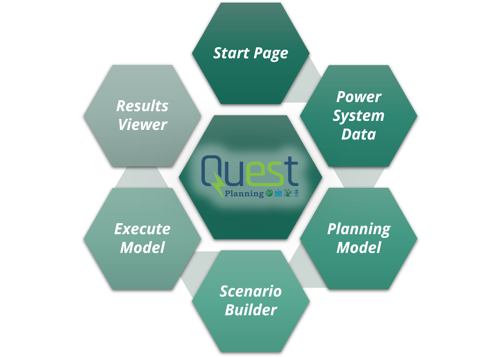-->

#### 1. Start
Upon executing the `quest_planning` package, a landing page will appear. The `Documentation` button will provide access to this `README.md` file in a separate dialog window. To start using the tool press the `Start` button.

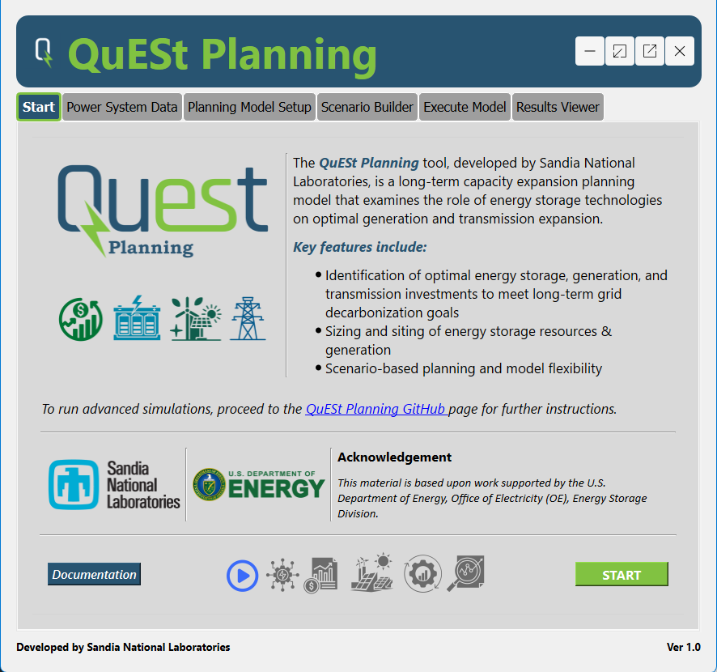

#### 2. Power System Data 
In the `Power System Data` page, the corresponding CSV data will be uploaded and processed via the data handler in the backend of the tool. To begin, the user must navigate to the correct directory where all CSV files are located. Use the `Browse` button to open File Explorer. The user should also fill in the `System Name` text box with the desired name. The `System name` will be used to name saved files, plots, and scenarios.


Once the correct directory is selected, click `Open`. Upon clicking a breakdown of the system information will appear as follows:

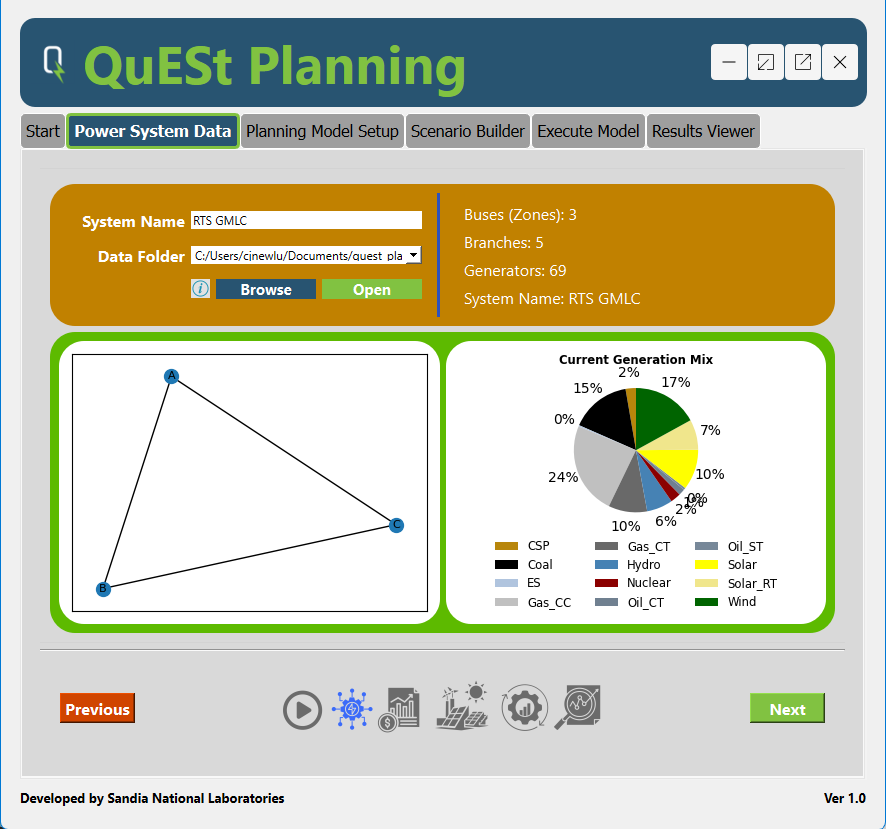

Once the data is collected, click `Next`.
#### 3. Planning Model Setup 
In the `Planning Model Setup` page, the user can define the modeling assumptions to be fed to the optimizer. Select the `Begin Year` and the `End Year` for the simulation. Then click the `Select Simulation Years` button and a separate dialog button will open.

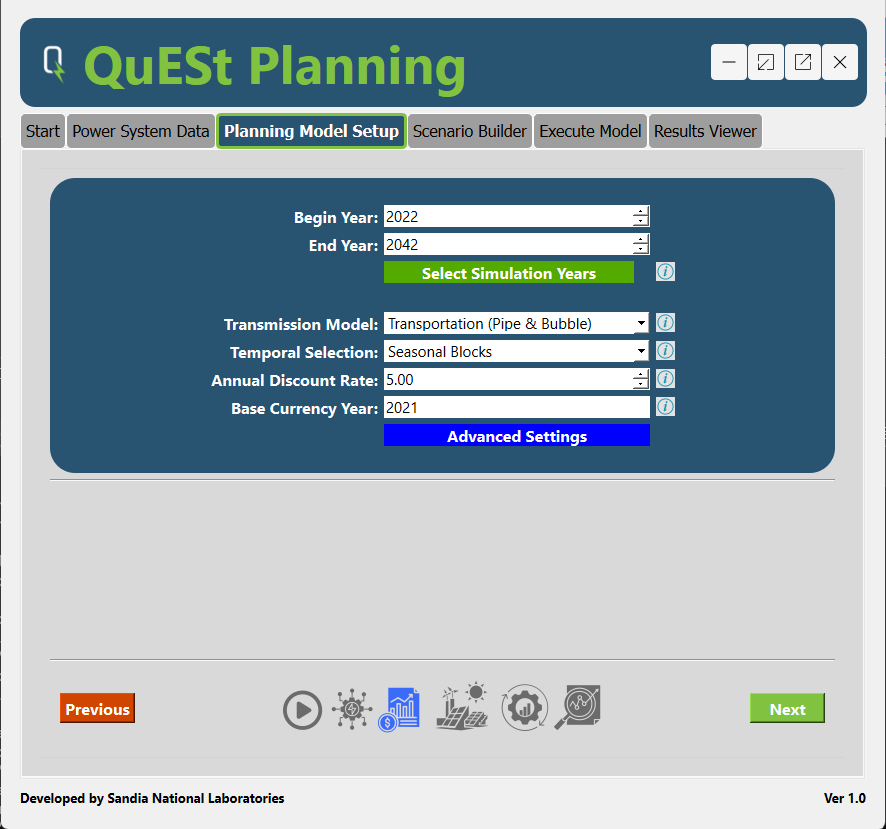

Select the years desired for the planning model simulation or select `All Years`. Click `OK` to save the years. 


Select the desired `Transmission Model`. Currently the tool supports the transportation ("pipes & bubbles") modeling of transmission systems. Future releases will support copper sheet and DC power flow capabilities. 

Select the desired `Temporal Resolution`. For quicker simulations, select `Seasonal Blocks`. More advanced features include `Representative Weeks` and `8760 Analysis`, which will be upcoming in a future release.

Select a desired `Annual Discount Rate`, which will be used for the net-present value calculations, and the `Base Currency Year`, which is used to scale costs based on the input data provided in the CSV files.

Once complete, the planning model setup will be populated in tab window as follows:

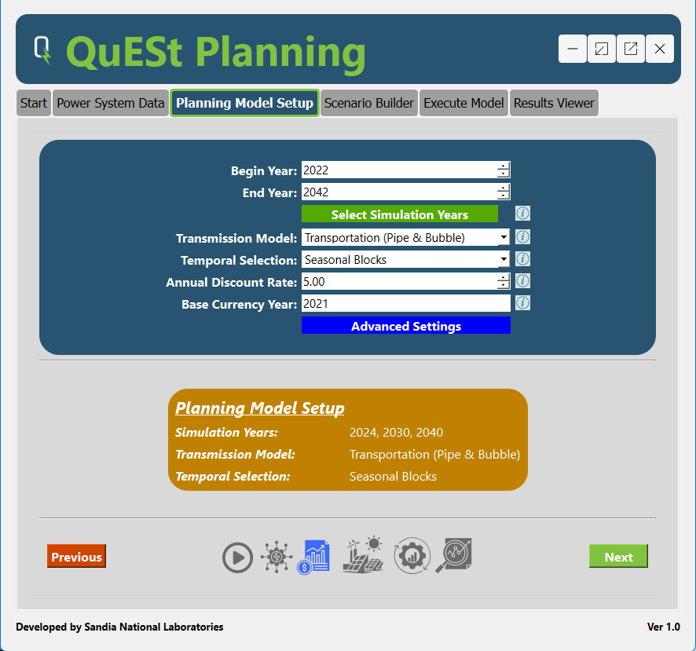

When the planning model is setup, click `Next`.
#### 4. Scenario Builder
In the `Scenario Builder` page, users are able to design and modify scenarios based on several planning uncertainties. To begin, specify a `Scenario Name` which will be used for file identification when printing the results.

Select a `capital cost trend used` for the energy storage capital costs. These capital cost trends are specified in the input CSV files.

Select a `Load Forecast`.

Select a `Renewable Portfolio Standard` or create a new policy. 

`Transmission Expansion` will allow for the co-optimization of the generation and transmission expansion. This feature is in testing will be released in a later version.

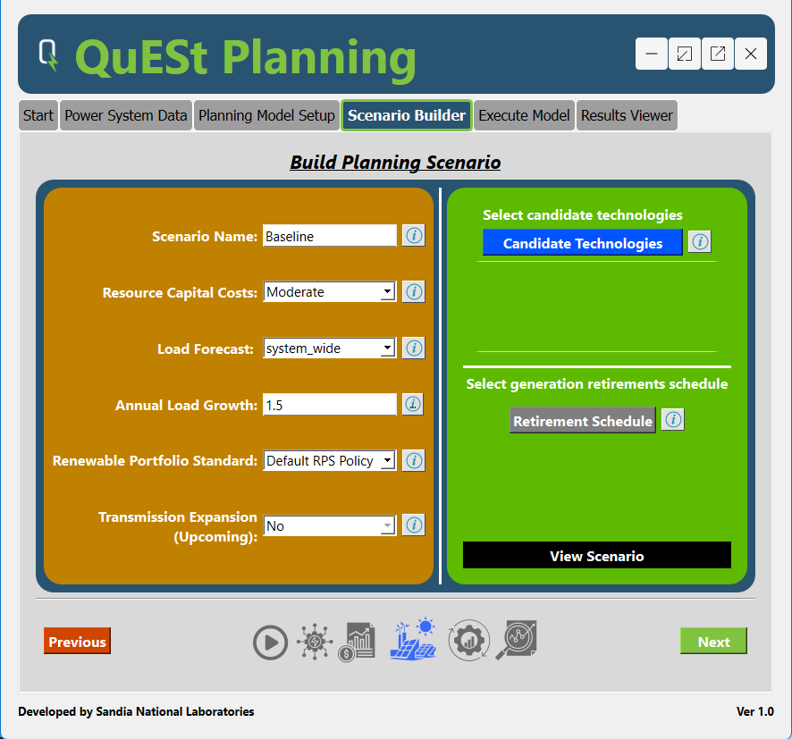

To select the candidate technologies click the `Candidate Technologies` buttons. The below window will appear. 


Select the `default` technologies, combination of the candidate technologies, or a `Custom` technology. If a `Custom` technology is selected, the following window will appear:

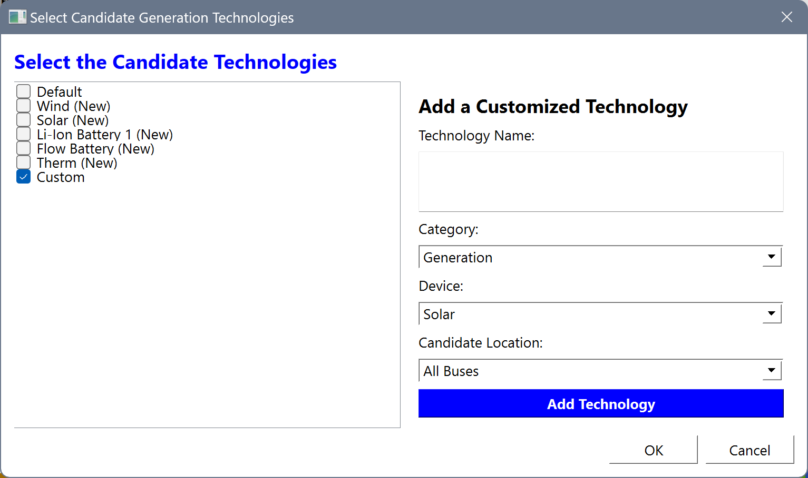

When completed selecting candidate technologies, press `OK`.

Once the scenario is built the window should look like the below:

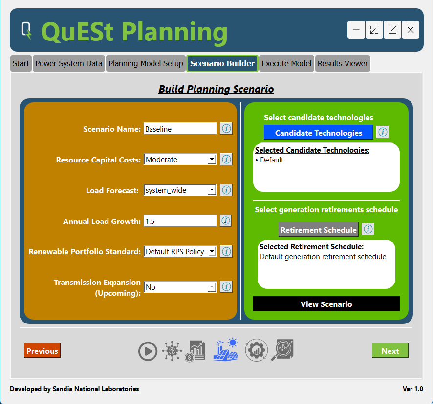

If desired, click `View Scenario`. This will generate a planning model and scenario information breakdown page. Click 'Save Scenario` to save this page to a text file. This is useful to keep track of the scenarios if evaluating several scenarios. 


When completed building the scenario, click `Next`. 

#### 5. Execute Model
In the `Execute Model` page, the optimization model will be built and solved. First, select a location to save the results. If a results folder is not selected, a folder in the main directory will be created. 

Specify the solver to be used for the optimization. For best performance, select `Gurobi`. Ensure that you have the solver installed correctly.

Click 'Build' to build the optimization model.

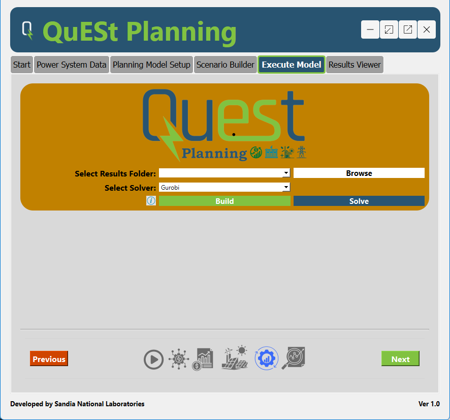

Progress will appear in the window as shown below. Once the Pyomo model has been built, click `Solve`.

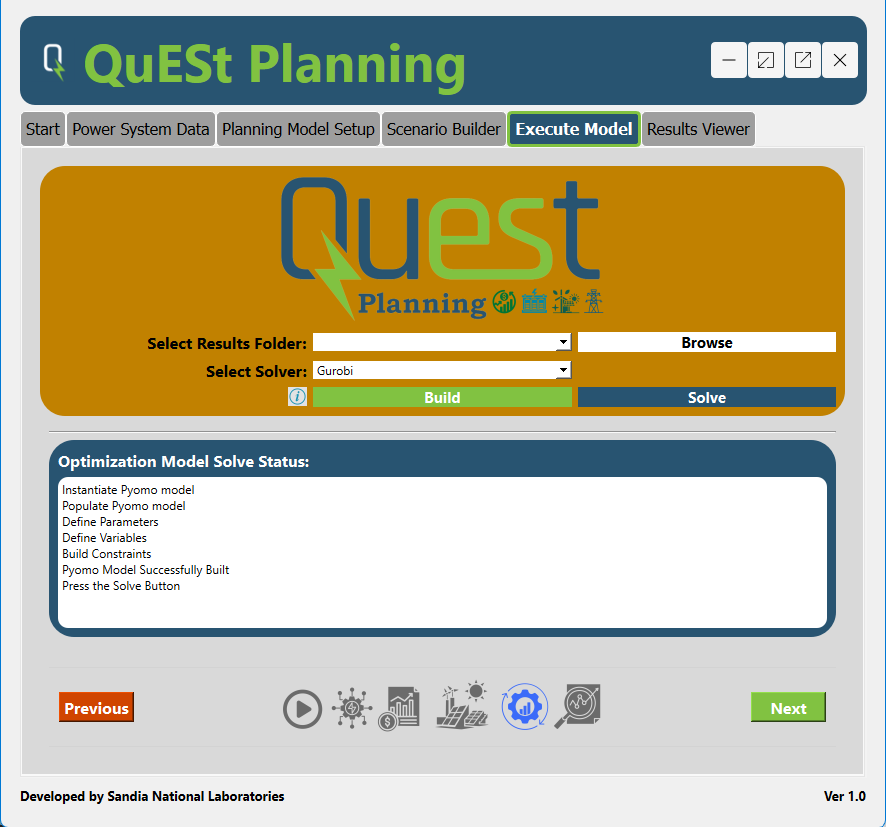

Once, the model has solved. The user will be notified and prompted to go to the `Results Viewer` page by clicking `Next`.

#### 6. Results Viewer

The `Results Viewer` page is designed to provide high-level results including a breakdown of total costs, optimal installed resource capacities, and energy storage power and energy capacities throughout the planning horizon.

To begin, click `Collect Results`. This will populate the cost results in a table and save all plots to the desired results file. 

Click `Generate Plots` to display the stacked bar charts for the optimal installed resource capacities and energy storage power and energy capacities throughout the planning horizon. 

Click `Open Results Folder` to open the results folder in File Explorer. 

Click `Open Maps` to open the subfolder containing several maps with generation and energy storage siting visualizations. 

Click `Save Results` to save the raw results of the optimization model to an Excel file. Further analysis of results can be performed with the results via the Excel files.

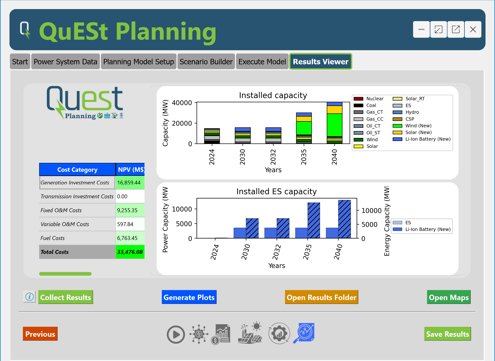

[Back to Top](#top)

[Back to Workflow Options](#workflow)

### Advanced Simulations<a id="advanced"></a>

For users seeking to analyze more complex scenarios or larger power systems, QuESt Planning offers the capability to run simulations through script-based execution without the use of the GUI. This approach is particularly beneficial for users leveraging the computational power of remote servers or High-Performance Computing (HPC) systems, which provide significantly more memory and processing capabilities than typical desktop environments.

#### Prerequisites

Ensure you have SSH access to the remote server if you wish to execute the script in and that Python is installed on the system.

#### Running Command-line Advanced Simulations

To initiate an advanced simulation, users can execute the `explan_simulation.py` script from the command line. This script is designed to process large datasets and complex simulation parameters efficiently.

##### 1. Create and Activate a Virtual Environment: 
1. Install `virtualenv` (if not already installed):
    ```bash
    pip install virtualenv
    ```

2. Create a virtual environment (named `venv`):
    ```bash
    virtualenv venv
    ```

3. Activate the virtual environment:
   - On Windows:
     ```bash
     .\venv\Scripts\activate
     ```

##### 2. Navigate to the QuESt Planning Directory: 
1. Navigate to the QuESt Planning Directory:
    
    ```bash
    cd path/to/quest_planning
    ```
   Replace `path/to/quest_planning` with the name of the directory where QuESt Planning was cloned.

   Ensure the `explan_simulation.py` script is located in the same home directory.

2. Install Dependencies:
    ```bash
    pip install -r requirements.txt
    ```

##### 3. Configure the Input File: 

 Before running the simulation, configure an `input.yaml` file with the specific simulation parameters. Open the file in a text editor and adjust the settings according to your scenario and planning model requirements. The required parameters are detailed in the test case provided. The configuration files are located in the `config` folder.

##### 4. Run the simulation:  
Once the configuration file is complete, run the `explan_simulation.py` file to initiate the simulation. 

```bash
python -m quest_planning.explan_simulation /path/to/input.yaml
```
Ensure that the `/path/to/input.yaml` is the correct location of the configuration file.

##### 5. Monitor the simulation:
The progress of the model build and the optimization solve will be provided in the command terminal. It is suggested to periodically monitor the progress throughout the simulation. 

##### 6. Access Results:
Once the model has solved, navigate to the `Results` directory to access results and visualizations. 

[Back to Top](#top)

## Examples<a id="examples"></a>

A test case is included with the initial release of QuESt Planning. The test case includes the [**IEEE RTS-GMLC synthetic grid**](<https://github.com/GridMod/RTS-GMLC>) which is a publicly available test system that is derived from IEEE RTS-96 test system. Figure 1 displays the nodal model of the RTS-GMLC test case that can be used for advanced simulations. Figure 2 provides a highly aggregated zonal RTS GMLC system that can be used for simple and quick simulations. 

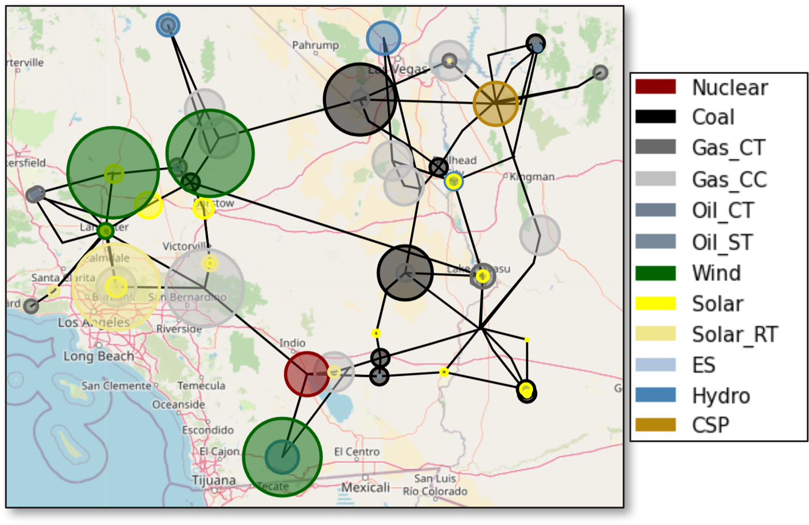

**Figure 1:** IEEE RTS-GMLC Test Case nodal model

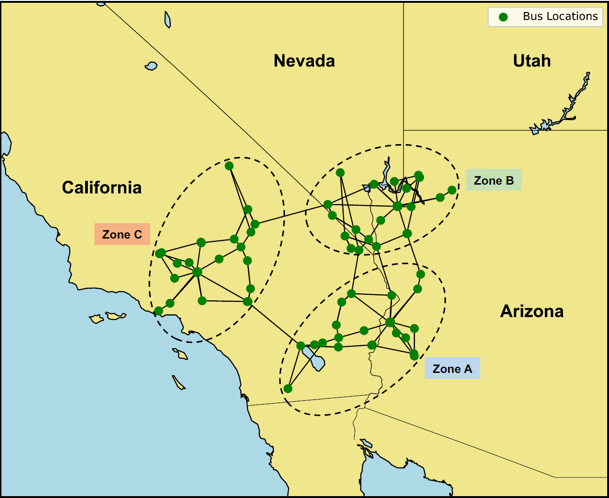

**Figure 2:** IEEE RTS-GMLC Test Case zonal model

The `data_explan` folder contains the RTS-GMLC test cases in the required format to run the QuESt Planning simulations. The nodal system is in the `rts_csv_data` folder and the zonal model is in the `rts_csv_data_zonal`. For Option A, which deploys the graphical user interface, follow the instructions detailed in the [**User-Interface Workflow**](#gui_workflow) section. For Option B, the advanced simulation option, follow the instructions detailed in the [**Advanced Simulations**](#advanced) section. The configuration files for a base case simulation of the nodal and zonal models are called `input_rts_nodal_base.yaml` and `input_rts_zonal_base.yaml`, respectively. These files are located in the `config` folder.  

### Data Sources & Data Preparation Tools

The QuESt Planning tool requires several data to run simulations. Listed below are common data sources that can be used to develop test cases for QuESt Planning:

#### Economic Data
- [**Annual Technology Baseline**](<https://atb.nrel.gov/>): provides cost and performance data for new and existing resources (developed by the National Renewable Energy Laboratory)
- [**Energy Storage Cost and Performance Database**](<https://www.pnnl.gov/ESGC-cost-performance>): provides cost and performance data for a variety of energy storage technologies (developed by Pacific Northwest National Laboratory)
- [**Energy Storage Pricing Survey**](<https://www.osti.gov/biblio/1866526>): provides a standardized reference system prices various energy storage technologies with different power and energy ratings. (Sandia National Laboratories)
- [**Annual Energy Outlook**](<https://www.eia.gov/outlooks/aeo/data/browser/>): provides regional projections of energy supply, demand, and fuel prices out to 2050 (developed by the Energy Information Administration)

#### Renewable Data

- [**National Solar Radiation Database**](<https://nsrdb.nrel.gov/>): hourly and half-hourly timeseries of solar irradiance in the U.S. and select countries (developed by the National Renewable Energy Laboratory)

- [pvlib](<https://github.com/pvlib/pvlib-python>): python-based package that includes a set of functions and classes used for simulating the performance of PV systems (developed by Sandia National Laboratories)

- [**Wind Integration National Dataset (WIND) Toolkit**](<https://www.nrel.gov/grid/wind-toolkit.html>): provides computer model-based meteorological conditions and calculated turbine power for the continental U.S. (developed by the National Renewable Energy Laboratory)

#### Generator Performance Data

- [**Form EIA-860**](<https://www.eia.gov/electricity/data/eia860/>): provides generator-level specific information about existing and planned generators (1 MW or greater)(developed by the Energy Information Administration)

#### Demand Data

- [**Form No. 714**](<https://www.ferc.gov/industries-data/electric/general-information/electric-industry-forms/form-no-714-annual-electric/data>): provides balancing authority and planning area generation, actual and scheduled power transfers, and load. (Provided by the Federal Energy Regulatory Commission)

#### Renewable & Energy Storage Policies

- [**Database of State Incentives for Renewables & Efficiency**](<https://www.dsireusa.org/>): comprehensive set of renewable policies and incentives in the United States (developed by North Carolina State University)

Additional test cases are under further development and will be included in future releases.

[Back to Top](#top)
## Tips for Running the QuESt Planning Tool<a id="tips"></a>

The advanced simulations could be exceptionally difficult to solve based on the configuration of the model. There are several tips to consider when facing difficulties with solving:

- ***Simplify the Model:*** Too increase tractability and decrease complexity, try limiting the number of variables or constraints. Examples include reducing the number of candidate technologies, reducing simulation years, altering the transmission model constraints, or selecting a less-complex temporal resolution. 

- ***Adjust Solver Settings:*** Adjust the solver parameters to explore different methods to improve the solver's performance. Alternatively, explore different solvers with varying capabilities based on the model formulation. Please refer to the corresponding solver documentation for more information and guidance. 

- ***Review Model Formulation:*** Carefully review the model formulation to identify logical errors or constraints that are too restrictive.

[Back to Top](#top)
## Feedback
<a id="feedback"></a>
Please submit feedback, issues, and suggestions, through the [Issues](<https://github.com/codynewlun/quest_planning/issues>) page.

[Back to Top](#top)
## Development Status & Future Updates
<a id="development-status"></a>

The QuESt Planning tool is under active development and more features will be included in future releases. the QuESt Planning tool will be integrated into the [QuESt 2.0](https://github.com/sandialabs/snl-quest), an open-source platform for energy storage analytics, where it will be available to be installed and integrated with other tools available in the QuESt platform. 

Future updates to QuESt Planning that are being considered include:

- *Technology-specific energy storage models*
- *Enhanced temporal resolution*
- *Improved transmission models & investment options*
- *Improved renewable energy resource modeling*
- *Improved GUI & scenario viewer*

[Back to Top](#top)
## Acknowledgment
<a id="acknowledgement"></a>
The QuESt Planning tool is developed and maintained by the [Energy Storage Analytics Group](<https://energy.sandia.gov/programs/energy-storage/analytics/>) at [Sandia National Laboratories](<https://www.sandia.gov/>).

Project team:
- Cody Newlun
- Atri Bera
- Walker Olis
- Andres Lopez Ramirez
- Yung-Jai Pomeroy
- Tu Nguyen

This material is based upon work supported by the **U.S. Department of Energy, Office of Electricity (OE), Energy Storage Division**.


<!---->

[Back to Top](#top)
## License

Please see the [LICENSE](<https://github.com/sandialabs/quest_planning/blob/main/LICENSE>) file. 

[Back to Top](#top)
